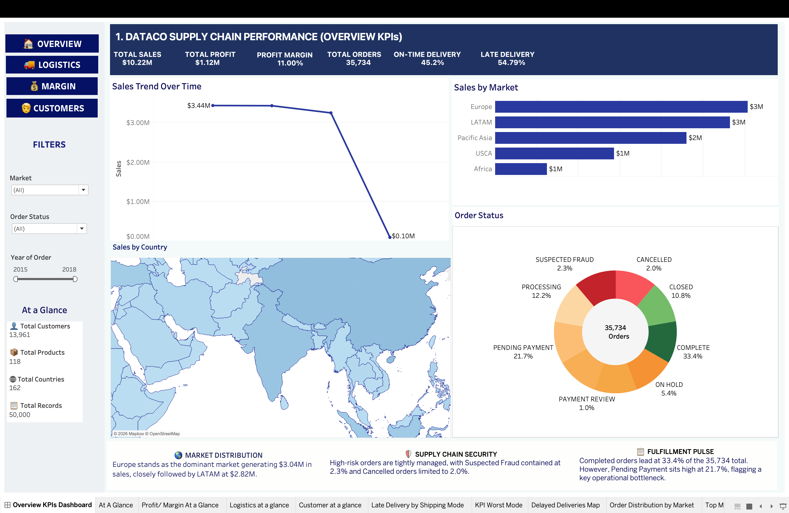
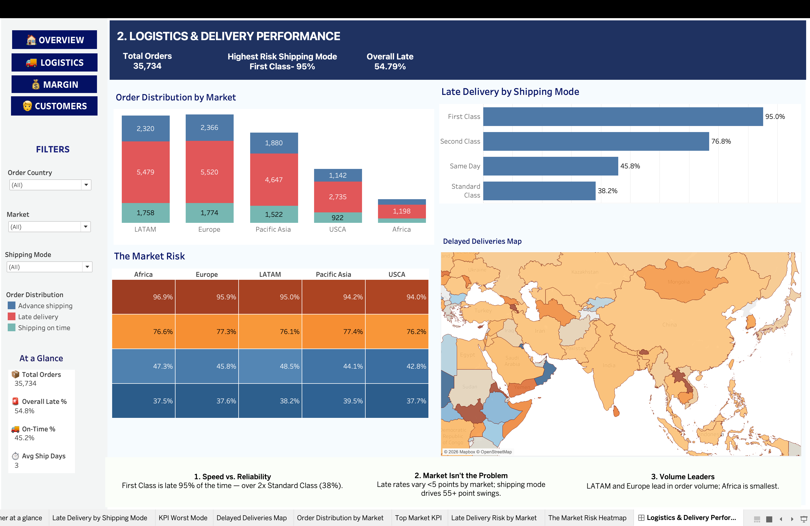
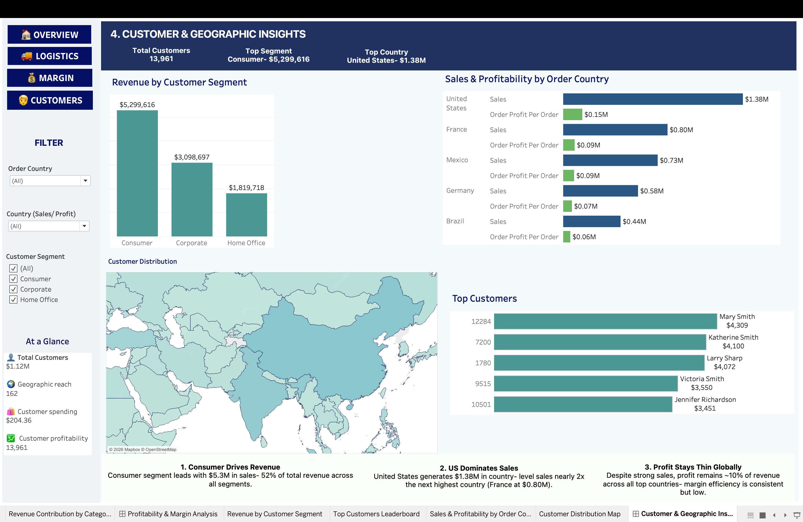
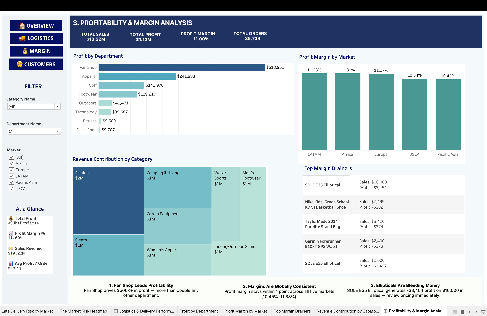

# 🚚 Global Supply Chain Analytics

`SQL (PostgreSQL)` · `MS EXCEL- Power Query (ETL)` · `Tableau Public`

---

## 📋 Project Description

This project analyzes **50,000+ order-line records** (35,734 unique orders, 13,961 unique customers) from a global supply chain company, spanning January 2015 to January 2018. The goal was to move beyond surface-level revenue reporting and pinpoint exactly where the business was losing money — through delivery failures, market over-concentration, and specific products that were quietly unprofitable.

The workflow covers the full analytics lifecycle: **Power Query** for data cleaning and ETL, **PostgreSQL** for structured exploratory analysis and business-question SQL (CTEs, window functions), and **Tableau** for translating the findings into a single interactive workbook with four executive dashboards.

---

## 🎯 Business Problem Statement

A company can look healthy on total revenue and still be losing money in ways that don't show up unless someone specifically looks for them. This project was built around three such problems:

- **Inconsistent on-time delivery performance** across shipping modes and regions, with no visibility into which specific mode or market was driving the issue.
- **Heavy revenue concentration** in a small number of markets, leaving the business exposed if any one of them underperforms.
- **Margin-eroding products** — items generating high sales while quietly operating at a net loss, invisible in a revenue-only view.

**Objective:** analyze the company's order-level transactional data to quantify each of these issues with real numbers, name the specific markets, shipping modes, and products responsible, and deliver the findings through a dashboard stakeholders could act on directly.

---

## 🎯 Project Objectives

| # | Objective | Deliverable |
|---|---|---|
| 1 | **Data Cleaning & Baseline KPIs** — clean and validate the dataset, establish core health metrics | Power Query cleaning steps + PostgreSQL KPI baseline |
| 2 | **Logistics & Bottleneck Diagnostics** — quantify on-time delivery performance by shipping mode, market, and region | SQL delay / late-delivery analysis |
| 3 | **Profit Leakage & Margin Audit** — identify "Margin Drainers" and quantify discount impact on margin | CTE / window-function SQL analysis |
| 4 | **Executive Dashboard Delivery** — build an interactive, cross-filtered dashboard with actionable recommendations | 4-dashboard Tableau workbook |

---

## 🛠 Methodology

**1. Data Cleaning — Power Query**
Identified `benefit_per_order` as a 100% duplicate of `order_profit_per_order` (verified across all 50,000 rows) during profiling; retained in the dataset for reference but excluded from all analysis. Validated data types, nulls, and date formatting.

**2. EDA & Analysis — PostgreSQL**
Loaded the dataset into a structured `orders_master` table. Established that the data sits at **order-line grain** (50,000 rows / 35,734 distinct orders) — a finding that shaped every downstream KPI, including a correct Average Order Value calculation (revenue ÷ distinct orders, not ÷ line items). Used CTEs and window functions (`DENSE_RANK`, running totals, benchmark-based market ranking) to answer 20 structured business questions.

**3. Visualization — Tableau**
Built a single workbook containing four linked dashboards — **Overview KPIs**, **Logistics & Delivery Performance**, **Customer & Geographic Insights**, and **Profitability & Margin Analysis** — each mapped to one project objective, with synchronized filters across all sheets.

---

## 🔍 Key Insights

**Baseline Performance**
| Metric | Value |
|---|---|
| Total Revenue | $10,218,031 |
| Total Profit | $1,124,340 (11.0% margin) |
| Total Orders | 35,734 (13,961 unique customers) |
| Average Order Value | $285.95 |
| Order Lines Delivered Late | 54.9% |

**🚨 Premium shipping is the least reliable.** First Class shipping has the highest late-delivery rate in the dataset at **94.8%**, followed by Second Class at 76.8%. Standard Class — despite the longest scheduled transit time — has the lowest late rate at **38.3%**, pointing to a scheduling-integrity problem on the premium tiers rather than a fulfillment-speed issue.

**🌍 Revenue is concentrated in two markets.** Europe ($3.04M) and LATAM ($2.82M) together generate **57% of total company revenue**, while Africa trails every other market at just $0.63M — a meaningful concentration risk.

**💸 Margin leakage is concentrated, not widespread.** The **SOLE E35 Elliptical** generated $15,999.92 in revenue but produced a net loss of **–$3,453.60 (–21.6% margin)**. Only one product crosses the high-revenue / net-negative-profit threshold — meaning the business doesn't have a broad profitability problem, it has a small number of specific pricing decisions actively destroying value.

---

## Dashboard Preview

### Overview KPIs

### Logistics & Delivery Performance

### Customer & Geographic Insights

### Profitability & Margin Analysis

## ✅ Conclusion

This project converted 50,000+ raw order-line records into a structured, decision-ready view of a global supply chain's delivery reliability and profitability. Establishing the data's true grain early shaped every downstream KPI, and every dashboard finding traces back to a specific, verifiable SQL query rather than an assumption.

The analysis surfaced three specific, actionable problems — an unreliable premium shipping tier, a revenue base concentrated in two markets, and a small set of products quietly destroying margin — each paired with a concrete recommendation. The result is an end-to-end analytics workflow (Power Query → PostgreSQL → Tableau) that mirrors how a real analytics function would operate inside a global supply chain business.

